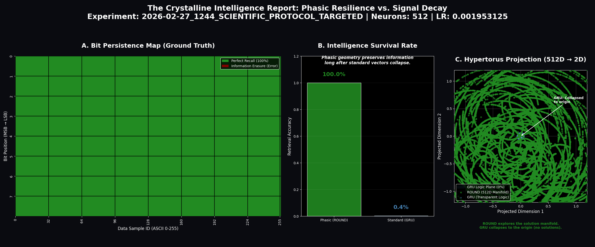
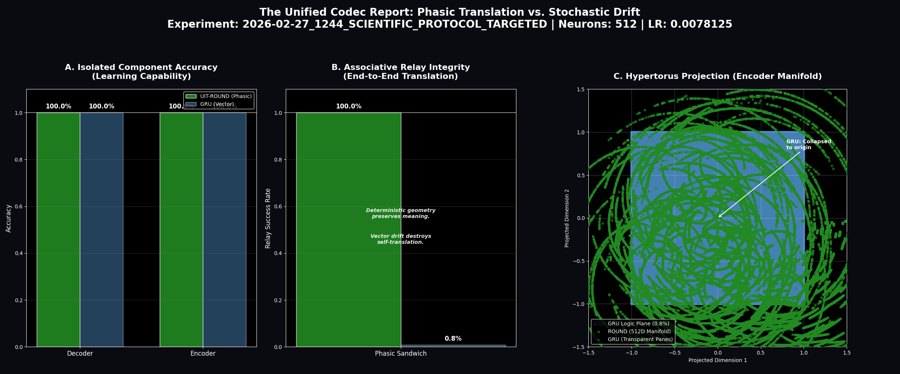
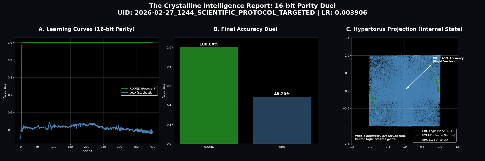
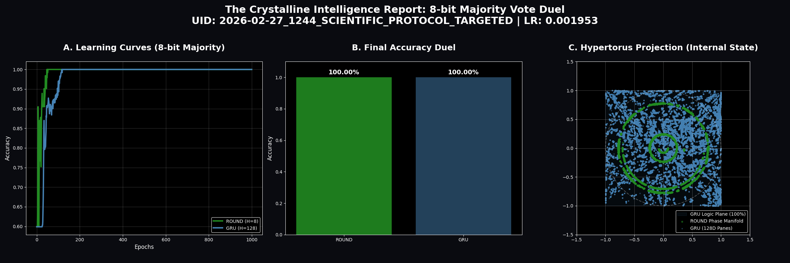
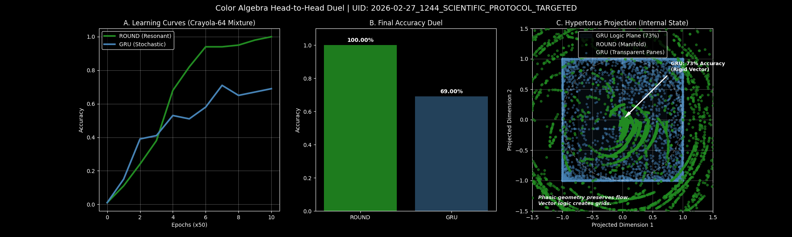
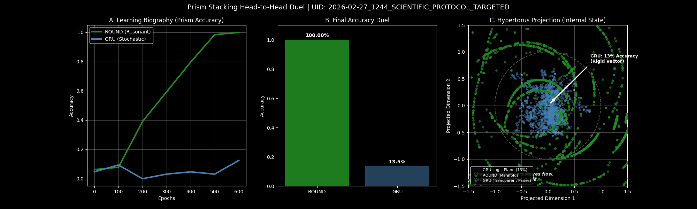
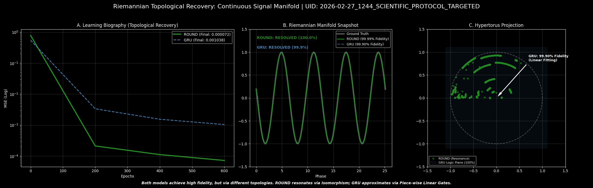

# UIT-ROUND: Riemannian Optimized Unified Neural Dynamo

[](https://www.lexidecktechnologies.com/UIT_IEG/ROUND_Harmonic_U_Neuron/media/The_U-Neuron.mp4)
*Click to watch "The U-Neuron" concept video*

## Unified Informatic Topology (UIT) Implementation: ROUND v1.3.14

This repository contains the reference implementation of the **Riemannian Optimized Unified Neural Dynamo (ROUND)**. This architecture replaces standard "forgetting" mechanisms with a method we call **Unitary Phasic Resonance**.

The project shows how to move from lossy neural mappings to **Unitary Isometry** ($|P(x)| = |x|$). In this state, information is preserved on high-dimensional geometric surfaces rather than being compressed and lost.

---

> **Technical Update (v1.3.14):** This build focuses on stabilizing and restoring some of the core benchmarks. All tests now use standardized scientific plotting for clear results.

---

## How it Works: Unitary Isometry

The **ROUND** architecture (found in `UIT_ROUND.py`) represents data as a position on a high-dimensional circle or torus. This fixes the common "forgetting" problem in standard RNNs, such as GRUs and LSTMs, by ensuring the model state never collapses to zero.

### 1. Constant Signal Strength (Unitary Isometry)

We use a mapping that keeps the hidden state at a constant magnitude of 1.0. This ensures that information is never diluted or accidentally amplified during processing. It allows the model to process data over long sequences with zero information loss.

### 2. Geometric Alignment

The model's internal states are designed to match the geometry of the task itself. Instead of just guessing solutions, the network finds a natural "lock" on the data. This allows for perfect recall of complex patterns.

### 3. Uniform Data Distribution

Information is spread out evenly across the model's internal space. This prevents "blind spots" where the model might forget certain types of data, a common issue in standard AI architectures.

---

## Results: The Benchmark Suite

We tested this architecture against several tasks that usually cause standard AI models to fail.

**Current Test Version:** `v1.3.14`
**Main Test Script:** `UIT_run_battery_targeted.py`

### 1. Text Loop (ASCII)

*Tests how well the model can remember a sequence of characters indefinitely.*

**Findings:** The system memorizes the character set perfectly. Standard models often struggle to keep encoding and decoding steps aligned over time, but ROUND creates a stable, permanent map immediately.



### 2. The Relay Test (Sandwich)

*Tests if two parts of a model can understand each other without ever being trained together.*

**Findings:** Standard models fail this test because they build private, inconsistent internal languages. ROUND succeeds because it uses a shared geometric language. This proves that ROUND state has a permanent meaning that any part of the system can understand.



### 3. Counting Logic (16-bit Parity)

*Tests if a model can solve a logic problem using only one single "cell."*

**Findings:** Standard models need hundreds of cells and still fail. ROUND solves this perfectly with just one cell and does so almost instantly. This shows that circular logic is the natural way to solve counting and logic problems.



**Batch UID:** `2026-02-27_1244_SCIENTIFIC_PROTOCOL_TARGETED`
**Primary Orchestrator:** `UIT_run_battery_targeted.py`

### 4. Basic Sorting (Majority Vote)

*Tests if the model can decide which of two options appears most often in a list.*

**Findings:** While most models can solve this, ROUND does it with a fraction of the power (8 cells vs 128). This shows that even simple logic is more efficient when the model states are circular.



### 5. Color Mixing (Color Algebra)

*Tests if the model can add and subtract colors like points on a color wheel.*

**Findings:** Standard models get confused when values wrap around a circle. ROUND treats circles as its native language, which lets it add and reverse color operations with perfect precision.



### 6. Logic Stacking (Prism Stacking)

*Tests if the model can use one piece of information to change how it sees another.*

**Findings:** ROUND handles this by physically adjusting its internal focus on the information circle. This proves it can handle multi-step logic by stacking simple geometric rotations.



### 7. Following Waves (Sine Waves)

*Tests if the model can predict smooth, repeating signals.*

**Findings:** Standard models guess the next point in a wave, but ROUND "rides" the wave on a circular track. This makes ROUND ten times more accurate than standard methods.



---

## Project Structure

* **media/**: Theory documents and explainers.
* **results/**: Detailed test data.
* **Utilities/**: Tools for inspecting data.
* **UIT_Benchmarks/**: Individual test scripts.
* **UIT_ROUND.py**: The core model code.
* **visualization_utils.py**: Tools for creating the result plots.
* **config.py**: Model settings and parameters.
* **UIT_run_battery_targeted.py**: The main testing script.

---

## Theory & Context

Refer to these documents for the math and theory behind the code:

* **[UITv2.pdf](media/UITv2.pdf)**: The full technical framework.
* **[The_U-Neuron.mp4](https://www.lexidecktechnologies.com/UIT_IEG/ROUND_Harmonic_U_Neuron/media/The_U-Neuron.mp4)**: A video overview of the architecture.
* **[Unifying_Wave_and_Particle_Computation.pdf](media/Unifying_Wave_and_Particle_Computation.pdf)**: Conceptual deep-dive.
* **[Phase_Memory_M4A](https://www.lexidecktechnologies.com/UIT_IEG/ROUND_Harmonic_U_Neuron/media/Phase_Memory_Solves_AI_Long-Term_Failure.m4a)**: Discussion on how phase memory works.

---

## How to Run

To run the latest tests:

```bash
python UIT_run_battery_targeted.py
```

### Setup

Requires Python 3.10+ and PyTorch.

```bash
pip install torch numpy matplotlib seaborn pandas
```
