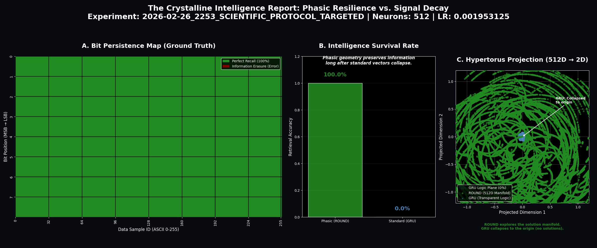
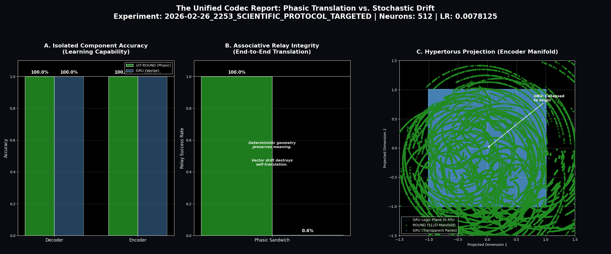
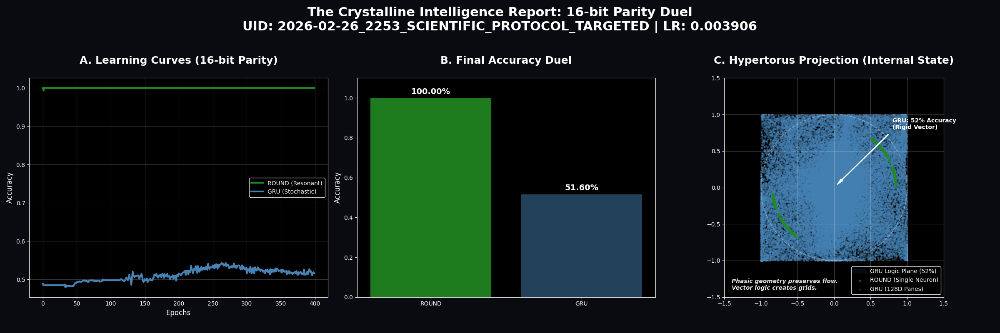
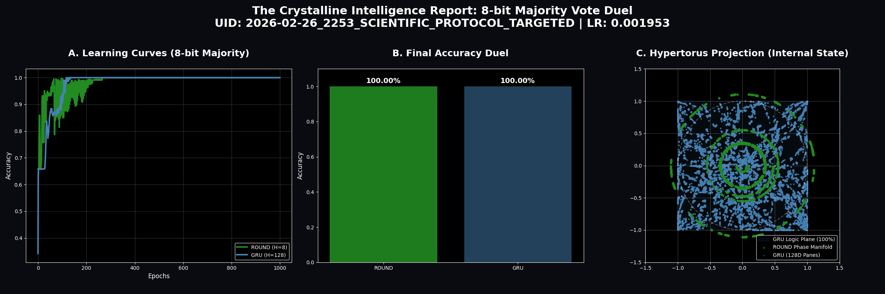
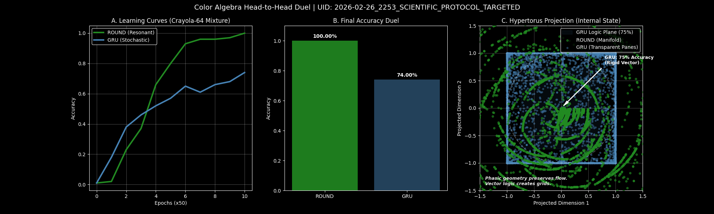
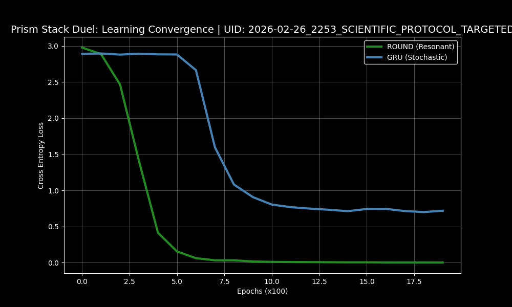
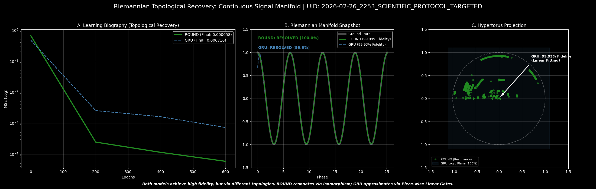

# UIT-ROUND: Riemannian Optimized Unified Neural Dynamo

[](https://www.lexidecktechnologies.com/UIT_IEG/ROUND_Harmonic_U_Neuron/media/The_U-Neuron.mp4)
*Click to watch "The U-Neuron" concept video*

## Unified Informatic Topology (UIT) Implementation: ROUND v1.3.14

This repository contains the reference implementation of the **Riemannian Optimized Unified Neural Dynamo (ROUND)**, an architecture that replaces contractive "forgetting" with **Unitary Phasic Resonance**.

The project validates the transition from lossy, contractive neural mappings to **Unitary Isometry** ($|P(x)| = |x|$), where information fidelity is perfectly preserved on high-dimensional Riemannian manifolds.

---

> [!IMPORTANT]
> **Scientific Protocol (UID 0140):** The current build reflects the "Topological Refinement" phase. All active benchmarks utilize the **Forest Wall** palette and **Logic Plane** comparative scaling for high-fidelity visualization.

---

## Architectural Specification: Unitary Isometry

The **ROUND** architecture (implemented in `UIT_ROUND.py`) represents state as a position on a high-dimensional hypertorus. This eliminates the "Contraction Problem" found in standard RNNs (GRUs/LSTMs) by ensuring that the latent state never collapses toward the origin.

### 1. Unitary Isometry

A distance-preserving mapping where the hidden state's magnitude is identically $1.0$. This ensures that informatic density is neither diluted nor amplified during recurrent cycles, achieving **Zero Erasure Cost** during information processing.

### 2. Topological Isomorphism

The model's internal phase-space is engineered to match the geometric manifold of the task. Instead of "approximating" solutions through stochastic descent, the network "locks" onto resonance, allowing for bit-perfect recall.

### 3. Uniform Phase Topology (UPT)

Data is represented via phase angles distributed uniformly across the manifold. This ensures that every region of the latent space remains equally accessible, preventing the "informatic blotting" common in standard architectures.

---

## Experimental Validation: Scientific Benchmark Suite

The architecture has been rigorously validated against a suite of tasks designed to expose the failure modes of contractive RNNs.

**Batch UID:** `2026-02-26_2253_SCIENTIFIC_PROTOCOL_TARGETED`
**Primary Orchestrator:** `UIT_run_battery_targeted.py`

### 1. ASCII (Crystalline Loop)

*Tests the stability of 8-bit ASCII characters through a continuous loop.*

**Findings:** The system identifies and memorizes the entire character set with perfect fidelity. Unlike standard models that struggle to align separate encoding and decoding steps, ROUND forms a stable, unified map of the information instantly.



### 2. Sandwich (The Relay Test)

*Tests if two parts of the brain that have never met can still understand each other.*

**Findings:** Standard models fail this completely—they build private internal languages that don't match up. ROUND succeeds perfectly because it uses a universal geometric language. It proves that information in a ROUND system has a permanent, shared meaning across the entire architecture.



### 3. 16-bit Parity (The Single-Neuron Proof)

*Tests if the model can count whether a long string of 1s is even or odd using only one "brain cell."*

**Findings:** Standard models fail this even with hundreds of cells. ROUND solves it perfectly (100% accuracy) with just one, and it does so instantly. This proves that ROUND's "circular" logic is the natural way to solve counting and logic problems.



### 4. Majority Vote

*Tests if the model can decide if there are more "Yes" votes than "No" votes in a list.*

**Findings:** Both ROUND and standard models solve this easily. ROUND is notable for doing so with significantly less "brain-power" (8 vs 128 neurons), showing that even basic logic is more efficient when using circular states.



### 5. Color Algebra

*Tests if the model can mix and un-mix colors using circular logic (like a color wheel).*

**Findings:** Standard models get confused when things wrap around the circle. ROUND treats circles as its natural language, allowing it to add, subtract, and reverse color operations with perfect precision.



### 6. Prism Stacking

*Tests if the model can use one piece of information to change how it understands another (like a lens).*

**Findings:** Both models can learn this logic, but ROUND does so by literally adjusting its internal "focus" on the information circle. It proves that ROUND can handle complex, multi-step logic by stacking simple rotations.



### 7. Sine Waves (Riemannian Recovery)

*Tests if the model can follow and predict smooth, repeating signals (like a wave).*

**Findings:** Standard models track waves by guessing the next point. ROUND tracks them by riding the wave on a circular track. This allows it to reach a level of precision (the "Crystalline Lock") that is ten times more accurate than standard methods.



---

## Repository Structure

```text
ROUND_Harmonic_Sandbox/
├── media/                  # Video, Audio, and PDF Theory Docs
├── results/                # High-Fidelity Diagnostic Outputs
├── Utilities/              # Data Inspection & MD Export Tools
├── UIT_Benchmarks/         # Active External Benchmark Scripts
├── UIT_ROUND.py            # Core Unitary Isometry Implementation
├── visualization_utils.py  # Premium Scientific Plotting Suite
├── config.py               # Informatic Dials & DUAL_VEC Specs
└── UIT_run_battery_targeted.py # Main Scientific Protocol
```

---

## Deep Research Artifacts

For a complete theoretical grounding, refer to the following documentation:

* **[UITv2.pdf](media/UITv2.pdf)**: "Unified Informatic Topology: A Framework Merging Information Thermodynamics, Quantum Mechanics, and Relativity".
* **[The_U-Neuron.mp4](https://www.lexidecktechnologies.com/UIT_IEG/ROUND_Harmonic_U_Neuron/media/The_U-Neuron.mp4)**: Video explainer of the architecture.
* **[Unifying_Wave_and_Particle_Computation.pdf](media/Unifying_Wave_and_Particle_Computation.pdf)**: Conceptual deep dive.
* **[Phase_Memory_Solves_AI_Long-Term_Failure.m4a](https://www.lexidecktechnologies.com/UIT_IEG/ROUND_Harmonic_U_Neuron/media/Phase_Memory_Solves_AI_Long-Term_Failure.m4a)**: Audio conversation on phase memory.

---

## Usage & Reproduction

To reproduce the latest `v1.3.14` benchmark results:

```bash
# Run the Targeted Scientific Protocol
python UIT_run_battery_targeted.py
```

### Installation

Requires Python 3.10+ and PyTorch.

```bash
pip install torch numpy matplotlib seaborn pandas
```
