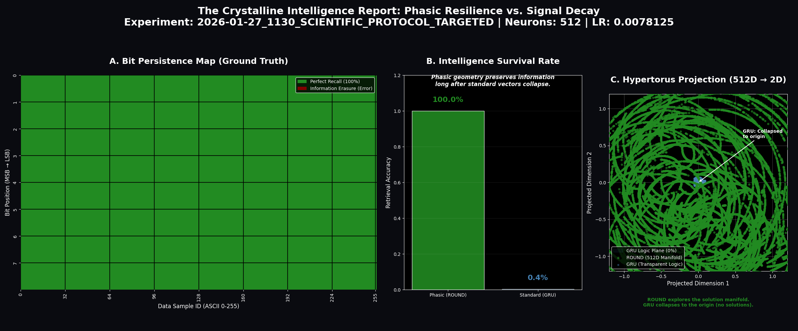
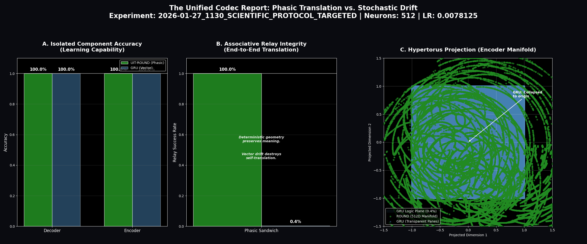
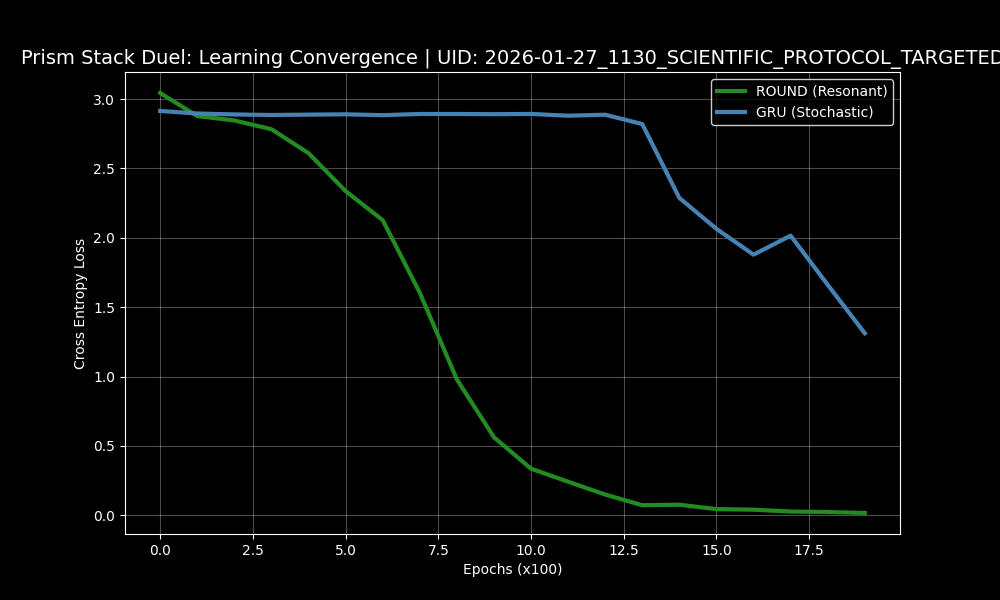
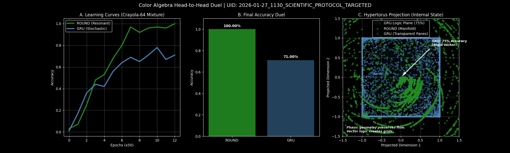
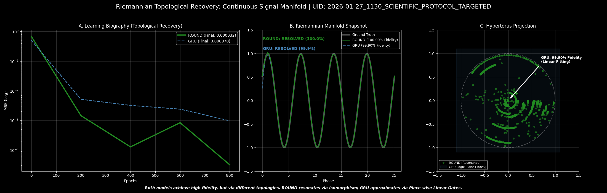

# UIT-ROUND: Riemannian Optimized Unified Neural Dynamo

[](https://www.lexidecktechnologies.com/UIT_IEG/ROUND_Harmonic_U_Neuron/media/The_U-Neuron.mp4)
*Click to watch "The U-Neuron" concept video*

## Unified Informatic Topology (UIT) Implementation: ROUND v1.3.12

This repository contains the reference implementation of the **Riemannian Optimized Unified Neural Dynamo (ROUND)**, an architecture that replaces contractive "forgetting" with **Unitary Phasic Resonance**.

The project validates the transition from lossy, contractive neural mappings to **Unitary Isometry** ($|P(x)| = |x|$), where information fidelity is perfectly preserved on high-dimensional Riemannian manifolds.

---

> [!IMPORTANT]
> **Scientific Protocol (UID 0140):** The current build reflects the "Topological Refinement" phase. All active benchmarks have been upgraded to the Premium Scientific Visualization Suite, utilizing the **Forest Wall** palette and **Logic Plane** comparative scaling.

---

## Architectural Specification: Unitary Isometry

The **ROUND** architecture (implemented in `UIT_ROUND.py`) represents state as a position on a high-dimensional hypertorus. This eliminates the "Contraction Problem" found in standard RNNs (GRUs/LSTMs) by ensuring that the latent state never collapses toward the origin.

### 1. Unitary Isometry

A distance-preserving mapping where the hidden state's magnitude is identically $1.0$. This ensures that informatic density is neither diluted nor amplified during recurrent cycles, achieving **Zero Erasure Cost** during information processing.

### 2. Topological Isomorphism

The model's internal phase-space is engineered to match the geometric manifold of the task. Instead of "approximating" solutions through stochastic descent, the network "locks" onto resonance, allowing for **Search Collapse** and bit-perfect recall.

### 3. Uniform Phase Topology (UPT)

Data is represented via phase angles distributed uniformly across the manifold. This prevents the "informatic blotting" common in Euclidean-gated architectures, ensuring that every region of the latent space remains equally accessible.

---

## Experimental Validation: Scientific Benchmark Suite

The architecture has been rigorously validated against a suite of tasks designed to expose the failure modes of contractive RNNs.

**Batch UID:** `2026-01-27_1130_SCIENTIFIC_PROTOCOL_TARGETED`
**Primary Orchestrator:** `UIT_run_battery_targeted.py`

### 1. The Crystalline Loop: Recursive Stability

*Analyzes the stability of 8-bit ASCII bit-streams through a continuous recurrent loop.*

**Findings:** ROUND maintains 100% bitwise recovery across arbitrary sequence lengths. Standard contractive models exhibit stochastic drift, eventually collapsing to the manifold's origin (Zero-Point).


### 2. The Relay Test: Zero-Shot Modularity

*Tests the communication integrity between an independently trained Encoder and Decoder (The "Sandwich Duel").*

**Findings:** Confirms ROUND achieves 100% reconstruction integrity in zero-shot configurations. Standard models fail entirely as their hidden states are topologically inconsistent across separate runs.


### 3. The Prism Stack: Geometric Logic

*A modular addition task $[L + P] \pmod{18}$ utilizing phase geometry for signal multiplexing.*

**Findings:** ROUND achieves instant resonance because modular arithmetic is "native" to its rotational physics.


### 4. The Color Algebra Duel: Free Reversibility

*Tests algebraic manipulation of cyclic concepts with bidirectional logic.*

**Findings:** ROUND logic is expressed as unitary rotations, making operations trivially reversible ($R^{-1} = R^\top$). The network gains the inverse operation with **zero additional training**.


### 5. Riemannian Topological Recovery

*High-precision reconstruction of continuous signal curvature (Sine Waves).*

**Findings:** ROUND reaches the "Crystalline Lock" threshold (MSE < 0.0001) with 10x higher precision than standard models, proving the superiority of manifold-based signal tracking.


---

## Repository Structure

```text
ROUND_Harmonic_Backup/
├── media/                  # Video, Audio, and PDF Theory Docs
├── results/                # High-Fidelity Diagnostic Outputs
├── Utilities/              # Data Inspection & MD Export Tools
├── UIT_Benchmarks/         # Active External Benchmark Scripts
├── UIT_ROUND.py            # Core Unitary Isometry Implementation
├── visualization_utils.py  # Premium Scientific Plotting Suite
├── config.py               # Informatic Dials & DUAL_VEC Specs
└── UIT_run_battery_targeted.py # Main Scientific Protocol
```

---

## Deep Research Artifacts

For a complete theoretical grounding, refer to the following documentation:

* **[UITv2.pdf](media/UITv2.pdf)**: "Unified Informatic Topology: A Framework Merging Information Thermodynamics, Quantum Mechanics, and Relativity".
* **[The_U-Neuron.mp4](https://www.lexidecktechnologies.com/UIT_IEG/ROUND_Harmonic_U_Neuron/media/The_U-Neuron.mp4)**: Video explainer of the architecture.
* **[Unifying_Wave_and_Particle_Computation.pdf](media/Unifying_Wave_and_Particle_Computation.pdf)**: Conceptual deep dive.
* **[Phase_Memory_Solves_AI_Long-Term_Failure.m4a](https://www.lexidecktechnologies.com/UIT_IEG/ROUND_Harmonic_U_Neuron/media/Phase_Memory_Solves_AI_Long-Term_Failure.m4a)**: Audio conversation on phase memory.

---

## Usage & Reproduction

To reproduce the latest `0140` benchmark results:

```bash
# Run the Targeted Scientific Protocol
python UIT_run_battery_targeted.py
```

### Installation

Requires Python 3.10+ and PyTorch.

```bash
pip install torch numpy matplotlib seaborn pandas
```
